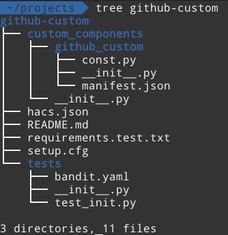

# Custom Component Structure

Базовая структура файлов и директорий, необходимая для работы пользовательского компонента ([[Home Assistant Custom Component]]).

Ключевые элементы:
- `custom_components/<домен_интеграции>/`: Корневая директория компонента.
- `manifest.json`: Содержит метаданные, ссылки на документацию и список внешних библиотек Python.
- `__init__.py`: Точка входа для инициализации компонента (часто содержит функцию `async_setup`).
- `sensor.py` (или файлы других доменов): Содержит логику настройки платформы (например, `async_setup_platform`) и определение класса сущности ([[Entity Class]]).

Рекомендуется использовать инструмент вроде [[Cookiecutter]] для автоматической генерации этой структуры.
